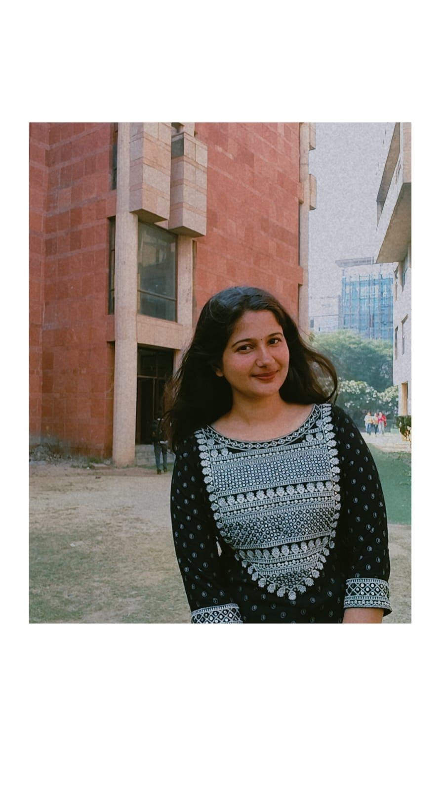

# Portfolio
<!DOCTYPE html>
<html lang="en">
  <head>
    <meta charset="UTF-8" />
    <meta name="viewport" content="width=device-width, initial-scale=1.0" />
    
    
    <title>Money Rawat's Portfolio</title>
  </head>
  <body class="bg-gradient-to-r from-cyan-500 to-yellow-500 text-white">
    <header class="text-center py-8">
      

        
        <h1 class="text-3xl font-bold mt-4">Money Rawat</h1>
        
Web Developer | C Programmer | Painter

      

    </header>

    <nav class="bg-gray-900 py-4 sticky top-0 w-full shadow-lg">
      <ul class="flex flex-wrap justify-center space-x-4 md:space-x-8">
        <li>
          <a href="#about" class="text-white hover:text-yellow-400 transition"
            >About Me</a
          >
        </li>
        <li>
          <a
            href="#education"
            class="text-white hover:text-yellow-400 transition"
            >Education</a
          >
        </li>
        <li>
          <a
            href="#projects"
            class="text-white hover:text-yellow-400 transition"
            >Projects</a
          >
        </li>
        <li>
          <a href="#skills" class="text-white hover:text-yellow-400 transition"
            >Skills</a
          >
        </li>
        <li>
          <a href="#contact" class="text-white hover:text-yellow-400 transition"
            >Contact</a
          >
        </li>
      </ul>
    </nav>

    <section
      id="about"
      class="max-w-4xl mx-auto bg-white text-gray-900 p-6 mt-6 rounded-lg shadow-md"
    >
      <h2 class="text-2xl font-bold mb-2">About Me</h2>
      

        Hi, I am Money Rawat, a passionate web developer and C programmer.
        Besides coding, I love reading books and painting. I’m currently working
        on building projects that improve my programming and problem-solving
        skills.
      

    </section>

    <section
      id="education"
      class="max-w-4xl mx-auto bg-white text-gray-900 p-6 mt-6 rounded-lg shadow-md"
    >
      <h2 class="text-2xl font-bold mb-2">Education</h2>
      <table class="w-full border-collapse border border-gray-300 text-center">
        <tr class="bg-gray-200">
          <th class="border p-2">Qualification</th>
          <th class="border p-2">Board</th>
          <th class="border p-2">Percentage</th>
        </tr>
        <tr>
          <td class="border p-2">10th Grade</td>
          <td class="border p-2">CBSE</td>
          <td class="border p-2">81.6%</td>
        </tr>
        <tr>
          <td class="border p-2">12th Grade</td>
          <td class="border p-2">Bihar Board</td>
          <td class="border p-2">87%</td>
        </tr>
      </table>
    </section>

    <section
      id="projects"
      class="max-w-4xl mx-auto bg-white text-gray-900 p-6 mt-6 rounded-lg shadow-md"
    >
      <h2 class="text-2xl font-bold mb-2">Projects</h2>
      <ul class="list-disc pl-6">
        <li>
          <strong>Calculator in C:</strong> A simple arithmetic calculator built
          using C programming.
        </li>
        <li>
          <strong>Puzzle Game:</strong> A fun and interactive web-based puzzle
          game.
        </li>
        <li>
          <strong>Calendar:</strong> A fully functional web-based calendar.
        </li>
      </ul>
    </section>

    <section
      id="skills"
      class="max-w-4xl mx-auto bg-white text-gray-900 p-6 mt-6 rounded-lg shadow-md"
    >
      <h2 class="text-2xl font-bold mb-2">Technical Skills</h2>
      

        HTML
        CSS
        JavaScript
        C Programming
      

    </section>

    <section
      id="contact"
      class="max-w-4xl mx-auto bg-white text-gray-900 p-6 mt-6 rounded-lg shadow-md"
    >
      <h2 class="text-2xl font-bold mb-2">Contact Info</h2>
      

        <strong>Email:</strong>
        <a href="mailto:rawatmoney913@gmail.com" class="text-blue-500"
          >rawatmoney913@gmail.com</a
        >
      

      

        <strong>Phone:</strong>
        <a href="tel:+918923474119" class="text-blue-500">8923474119</a>
      

    </section>

    <footer class="text-center py-4 mt-6 bg-gray-900 text-white">
      
&copy; 2025 Money Rawat. All rights reserved.

    </footer>
  </body>
</html>
